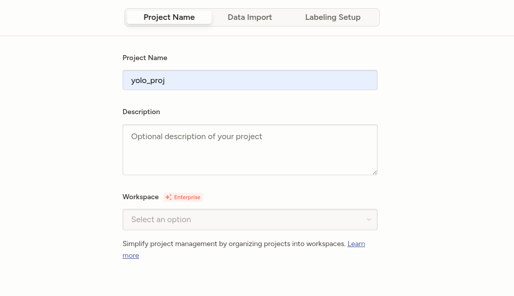
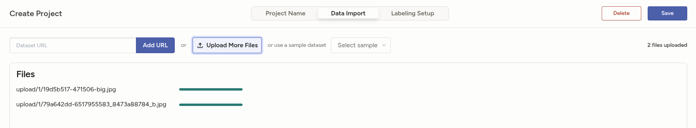
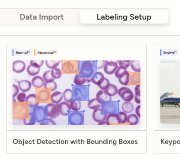
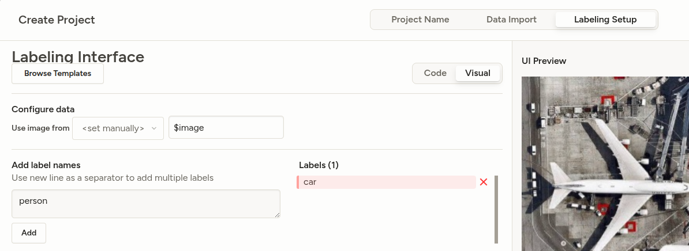
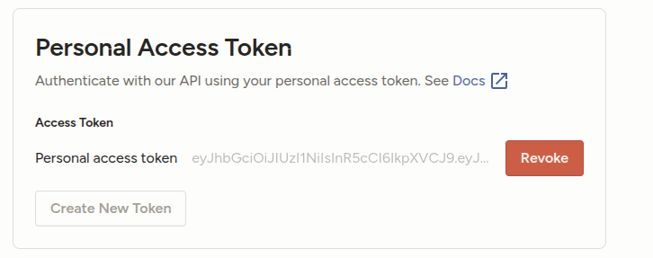
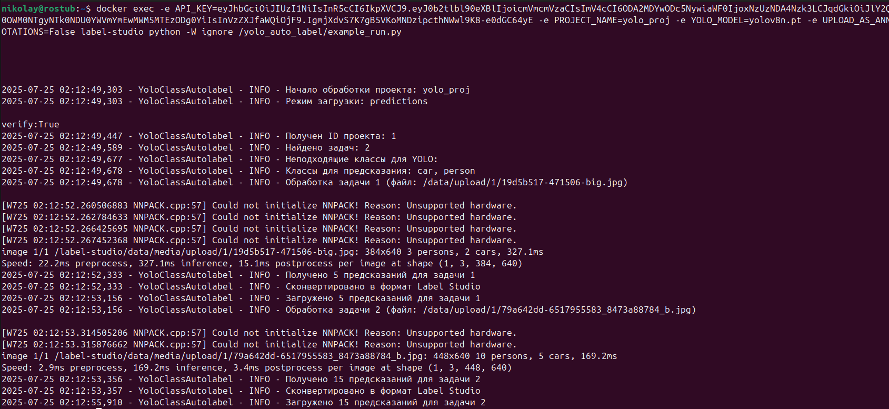
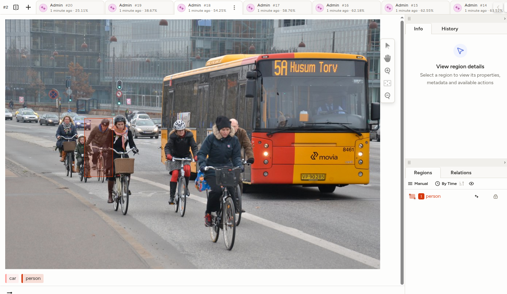
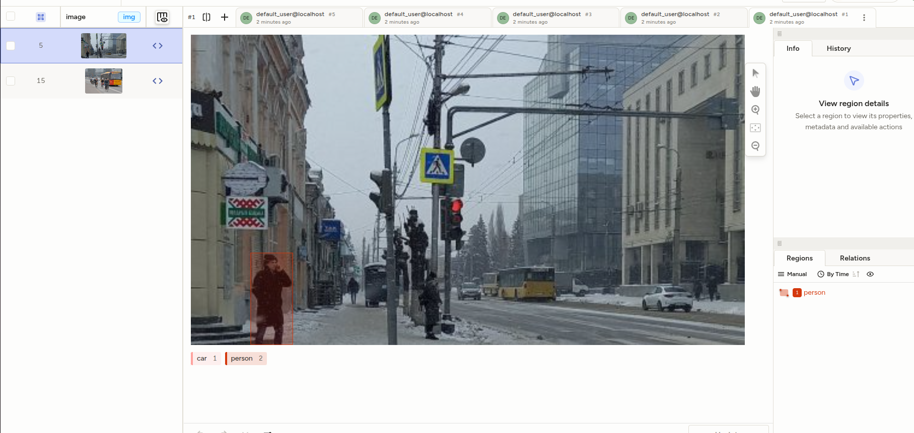

# YoloAutoLabeling in Label Studio

### О проекте:
Этот проект позволяет автоматизировать разметку bboxes на изображениях с помощью модели YOLOv8+ в Label Studio.

## Запуск сервиса

1. Убедитесь, что у вас установлен **docker compose**
2. Запустите контейнер в папке **yolo-ls**:

    docker compose up -d

3. Подождите, пока установится образ и все зависимости для среды

## Работа с сервисом

### Настройка Label Studio

1. Необходимо перейти в [Label Studio](http://localhost:8080/) по http://localhost:8080/ и авторизоваться:

    Логин: default_user@localhost
    Пароль: 12345

2. Создаем проект, называем его

3. Загружаем изображения

4. В выборе задачи выбираем Object Detection with Bounding Boxes

5. Указываем классы объектов, которые будут аннотироваться, выберите, из *списка ниже*

#### Список объектов, которые YOLOv8 может определить:
person, bicycle, car, motorcycle, airplane, bus, train, truck,
boat, traffic, light, fire, hydrant, stop, sign, parking, meter,
bench, bird, cat, dog, horse, sheep, cow, elephant, bear, zebra,
giraffe, backpack, umbrella, handbag, tie, suitcase, frisbee, skis,
snowboard, sports, ball, kite, baseball, bat, baseball, glove,
skateboard, surfboard, tennis, racket, bottle, wine, glass, cup,
fork, knife, spoon, bowl, banana, apple, sandwich, orange,
broccoli, carrot, hot, dog, pizza, donut, cake, chair, couch,
potted, plant, bed, dining, table, toilet, tv, laptop, mouse,
remote, keyboard, cell, phone, microwave, oven, toaster, sink,
refrigerator, book, clock, vase, scissors, teddy, bear, hair,
drier, toothbrush

6. **Сохраняем**

7. Заходим в настройки и создаем API-ключ, сохраняем его

### Запуск автоматической аннотации с YOLOv8+

1. Открываем консоль и вводим следующую команду:

    docker exec -e API_KEY=<Ваш ключ API> -e PROJECT_NAME=<Имя проекта> -e YOLO_MODEL=<Имя модели> -e UPLOAD_AS_ANNOTATIONS=<True or False> label-studio python -W ignore /yolo_auto_label/example_run.py

- **API_KEY** - Ваш скопированный API-ключ
- **PROJECT_NAME** - Имя проекта, для которого будет произведена аннотация
- **YOLO_MODEL** - Модель YOLO, которая будет использоваться, выбрать из списка ниже (!!! Указывать с .pt, например yolov8n.pt)
- **UPLOAD_AS_ANNOTATIONS** - ***True*** - загрузить как annotations, ***False*** - загрузить как predictions

Список моделей YOLOv8:

| Модель     | Размер   |
|------------|----------|
| yolov8n.pt | Nano     |
| yolov8s.pt | Small    |
| yolov8m.pt | Medium   |
| yolov8l.pt | Large    |
| yolov8x.pt | Huge     |

2. Перезагружаем страницу в Label Studio - **Готово!** Изображения аннотированы

## Примеры аннотированных изображений:

**predictions:**

**annotations:**

