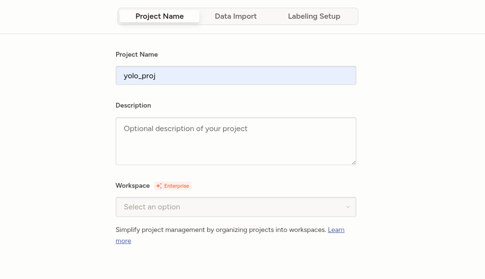
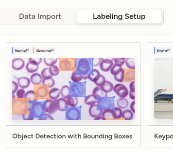
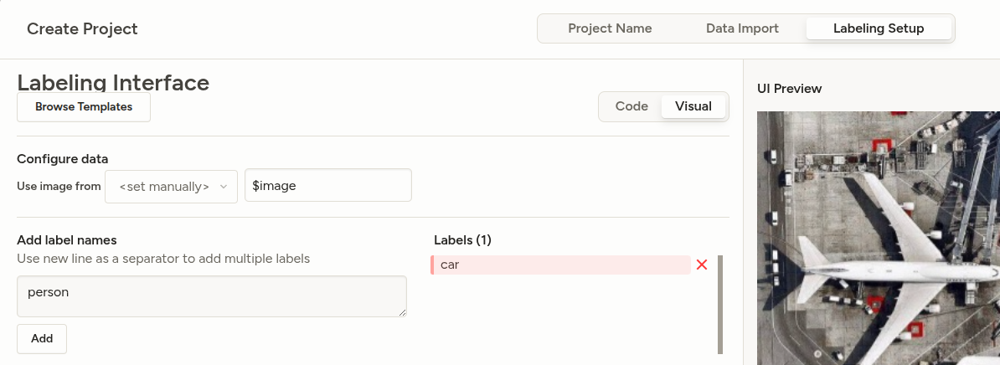
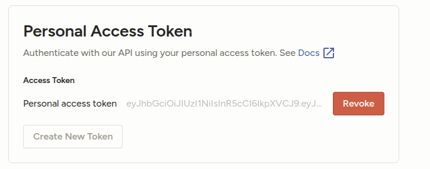
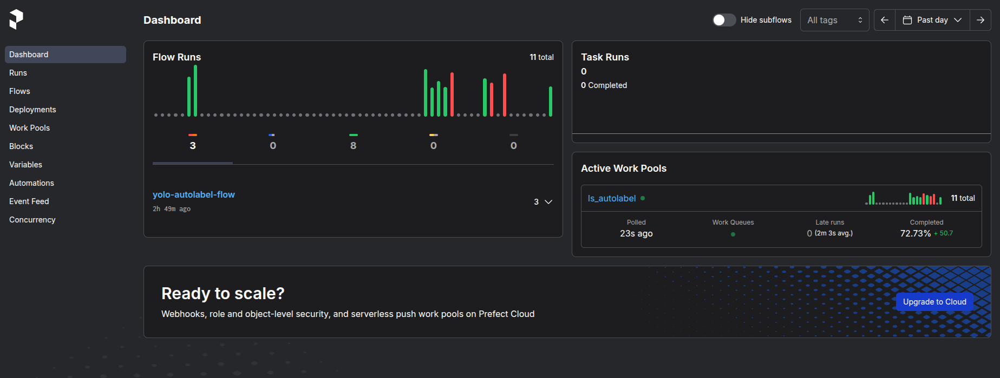
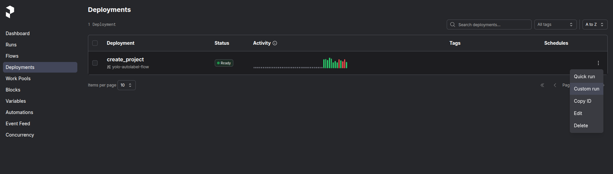
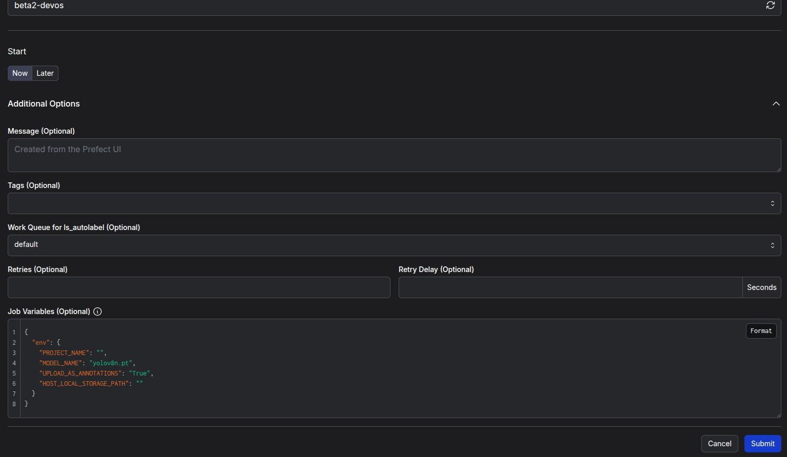
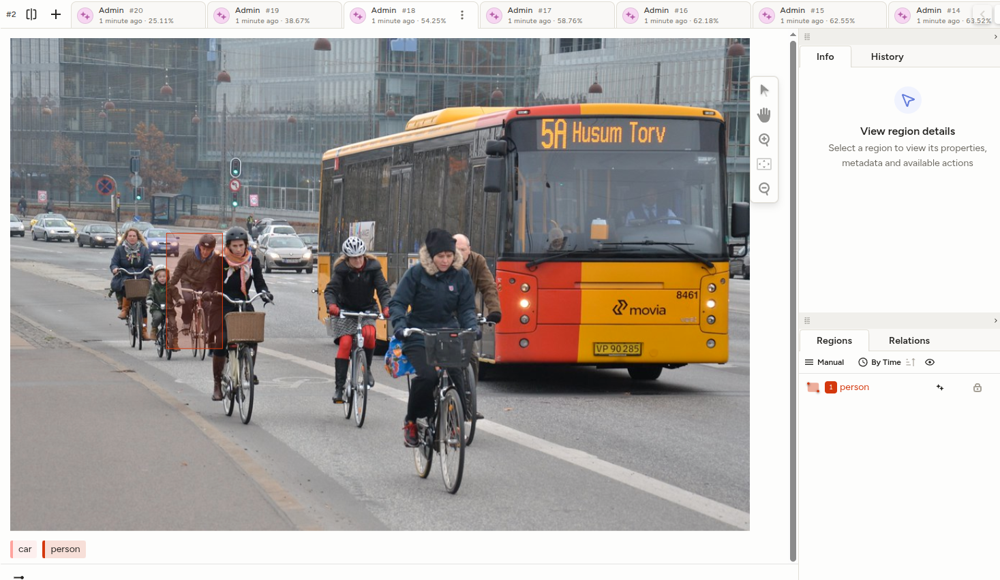
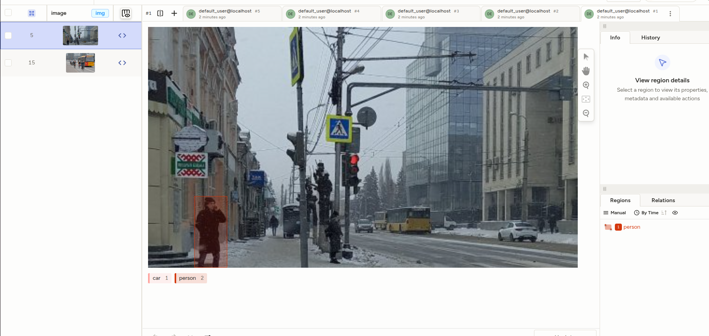

# YoloAutoLabeling in Label Studio

### О проекте:
Этот проект позволяет автоматизировать разметку bboxes на изображениях с помощью модели YOLOv8+ и Prefect Server в Label Studio.

## Запуск сервиса

1. Убедитесь, что у вас установлен **docker compose**
2. Запустите контейнер в папке **yolo-ls/docker**:

```bash
docker compose up -d
```

3. Подождите, пока установится образ и все зависимости для среды

## Работа с сервисом

### Настройка Label Studio

1. Необходимо перейти в [Label Studio](http://localhost:8080/) по http://localhost:8080/ и авторизоваться:
```
    Логин: default_user@localhost
    Пароль: 12345
```

2. Создаем проект, называем его



3. В выборе задачи выбираем Object Detection with Bounding Boxes



4. Указываем классы объектов, которые будут аннотироваться, выберите, из *списка ниже*



#### Список объектов, которые YOLOv8 может определить:
person, bicycle, car, motorcycle, airplane, bus, train, truck,
boat, traffic light, fire hydrant, stop sign, parking meter,
bench, bird, cat, dog, horse, sheep, cow, elephant, bear, zebra,
giraffe, backpack, umbrella, handbag, tie, suitcase, frisbee, skis,
snowboard, sports ball, kite, baseball bat, baseball glove,
skateboard, surfboard, tennis racket, bottle, wine glass, cup,
fork, knife, spoon, bowl, banana, apple, sandwich, orange,
broccoli, carrot, hot dog, pizza, donut, cake, chair, couch,
potted plant, bed, dining table, toilet, tv, laptop, mouse,
remote, keyboard, cell phone, microwave, oven, toaster, sink,
refrigerator, book, clock, vase, scissors, teddy bear, hair drier,
toothbrush


5. Заходим в папку label_studio_files/tasks

6. Создаем папку, куда будем класть изображения для разметки, переносим туда изображения

7. В папку label_studio_files/models загружаем кастомную модель, при необходимости

8. Заходим в настройки Label Studio и создаем API-токен, сохраняем его



9. Заходим в src/prefect_flows/flows/yolo_auto_label/config.yaml и вставляем API-токен

### Запуск автоматической аннотации с YOLOv8+

1. Переходим в Prefect Server: http://localhost:4200/



2. Открываем Deployments, нажимаем три точки и Custom run для create_project в правой части



3. Нажимаем Additional Options и заполняем Job Variables (Optional):




Конфиг для заполнения:

```json
{
  "env": {
    "PROJECT_NAME": "",
    "MODEL_NAME": "yolov8n.pt",
    "UPLOAD_AS_ANNOTATIONS": "True",
    "HOST_LOCAL_STORAGE_PATH": ""
  }
}
```
- **PROJECT_NAME** - Имя проекта, для которого будет произведена аннотация
- **MODEL_NAME** - Модель YOLO, которая будет использоваться, выбрать из списка ниже (!!! Указывать с .pt, например yolov8n.pt)
- **UPLOAD_AS_ANNOTATIONS** - ***True*** - загрузить как annotations, ***False*** - загрузить как predictions
- **HOST_LOCAL_STORAGE_PATH** - Название папки, которую мы создали для хранения изображений в формате "/<название папки>/"


Список базовых моделей YOLOv8:

| Модель     | Размер   |
|------------|----------|
| yolov8n.pt | Nano     |
| yolov8s.pt | Small    |
| yolov8m.pt | Medium   |
| yolov8l.pt | Large    |
| yolov8x.pt | Huge     |

4. Нажимаем Submit - авторазметка запустилась

5. Перезагружаем страницу в Label Studio - **Готово!** Изображения аннотированы

**Примечание** Уже размеченные изображение вновь не будут аннотированы (но к annotations, можно добавить predictions, или наоборот). 

## Примеры аннотированных изображений:

**predictions:**



**annotations:**




